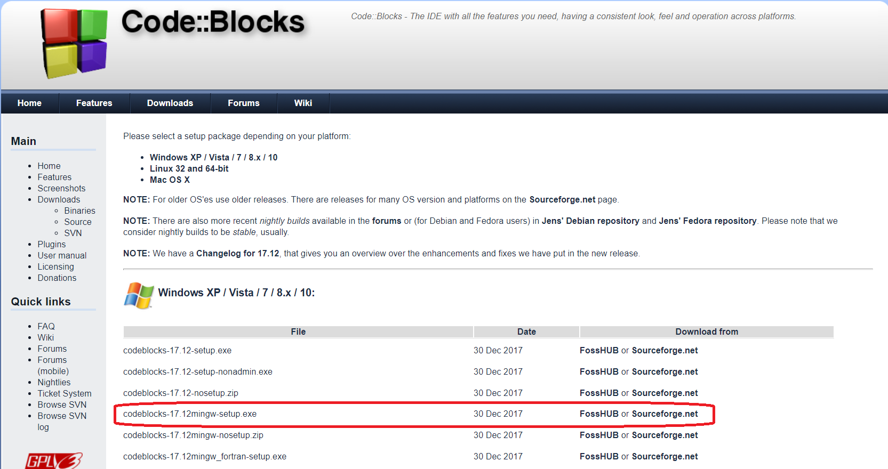

# Procedural programming in C
 Notes, scripts and excercises to conducted studies at Wroclaw University of Technology in summer 2018/2019

## Table of contents
* [General info](#general-info)
* [Screenshots](#screenshots)
* [Programming language](#technologies)
* [Status](#status)

## General info
Classes are conducted for technical physics and optics students at WUST.
The main goal of the course is to continue teaching basics of programming in C.

## Screenshots

## Programming language and enviroment
* C Programming Language
* Code::Blocks

## Features
List of features ready and TODOs for future development
* Solutions for some excercises

To-do list:
* Create directories for all laboratories
* Create comprehensive notes

## Status
Project is: _finished_
